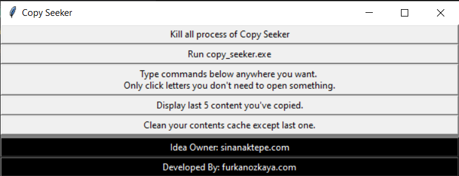
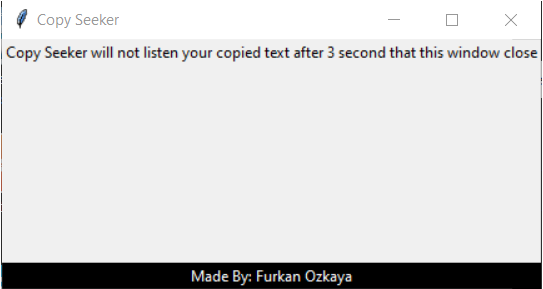

# Copy Seeker

## Introduction

Copy Seeker is a desktop application which allows you to access last five content you've copied quick and easily.

## Usage

1.) Run copy_seeker.exe

2.) Type commands below anywhere you want. 
Only click letters you don't need to open something.

```
 c s u 
```
==> Copy Seeker Ui

Display last 5 content you've copied.

```
 c s t
```

==> Copy Seeker Tidy

Clean your contents cache except last one.

```
c s k
```

==> Copy Seeker Kill

Kill all process of Copy Seeker
csu

3.) Click Which one you want to copy.



```python
c s u     # output
```



```python
c s k  # output
```

